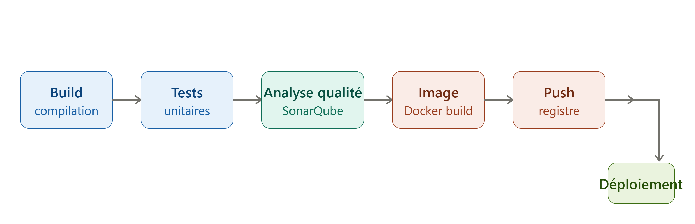

## Questionnaire

# Question 1 : 

La définition des pipline CI/CD dans le dépôt fournie ce trouve dans .github/workflow, il ce nomme build.yaml

# Question 2 : 

# Question 3 : 

Non, on ne peut pas garantir une reproduction à l'identique sans informations supplémentaires. GitHub Actions et Jenkins ont des modèles d'exécution différents (runners hébergés vs agent auto-hébergés, synthaxe YAML déclarative vs Groovy/Jenkinsfile, gestion native des secrets Github vs Credentials Jenkins). Les informations manquantes typiques sont : le contenu exact des workflows pour connaôtre les triggers, job, steps et actions tierces utilisés (ubuntu-latest, self-hosted...) et leurs verssions d'outils, les éventuelles Actions du marketplate sans équivalent Jenkins direct, les règles de déclenchement liées au branches/tags protégées, et les permission utilisées par le workflow. Sans le YAML, source, toute reconstruction reste une approximation fonctionnelle.

# Question 4 : 

Les points critiquables du fichier compose sont : 

- Le service sonarqube utilise le tag latest, ce qui casse la reproductibilité du pipeline et empêche tout audit de version. Même problème , sur `sonarsource/sonar-scanner-cli`qui n'a pas de tag du tout.

- La variable `SONAR_TOKEN`contient un jeton d'authentification SonarQube en clair, directement dans le compose .yaml. C'est une fuite de secret si ce fichier est commité dans un dépôt git. Ce token devrait être externalisé via un fichier .env non versionné...ou via un Docker

- La ligne commentée expose un chemin absolu spécifique à la machine de l'utilisateur...ce qui peut faire fuiter des informations sur l'environnement local de la personne qui a écrit le fichier.

- Le port 9000 est exposé sur l'hôte alors que dans un contexte de pipline automatisé, seul le service cli a besoin d'atteindre sonarqube, et ce via le réseau interne docker.

Le volume ".:/usr/src" monte le répertoire courant en lecture-écriture dans le conteneur du scanner. Si le scanner n'a besoin que de lire le code source pour l'analiser, ce montage devrait être restreint en lecture seule, par principe de moindre privilège.

# Question 5 : 

SonarQube n'est pas conçu pour être scalé horizontalement de façon naïve avec plusieurs instances identiques derrière un simple replicas. 
Le serveur SonarQube embarque une base de données d'index Elasticsearch interne et un état applicatif qui ne supportent pas le multi-instance actif-actif sans configuration spécifique.

# Question 6 : 

Il faudrait utiliser un réseau Docker externe partagé. On crée le réseau au préalable avec `docker network create nom_du_reseau`, puis chaque fichier compose déclare ce réseau comme externe et y attache les services concernés. Cela permet à des conteneur définis dans des fichier compose.yaml distincts de se résoudre mutuellement par leur nom de service via le DNS interne Docker, sans dépendre du réseau par défaut de chaque stack.

# Question 7 : 

Il faut utiliser l'alas DNS spécial host.docker.internal, qui résout vers l'IP de la machine hôte depuis l'intérieur d'un conteneur.

# Question 8 :

Il faut utiliser la notion d'alias réseau (networks.nomréseau.aliases) dans la déclaration du service côté compose. Cela permet à un même conteneur d'être joignable sous plusieurs nom DNS différents sur un même réseau Docker, sans dupliquer le conteneur.

# Question 9 : 

Plutôt que d'injecter directement la valeur en clair dans `environnement`, on peut utiliser plusieurs mécanisme : un fichier `.env` , ou pour les donner sensibles les Docker secrets.

Le secret est alors monté en lecteure seule.

# Question 10 : 

``FROM postgres:latest``
``ENV POSTGRES_PASSWORD = mypassword``

## Etape 9 

Rundeck est centré sur l'exécution de commandes et de scripts sur un parc de serveurs, avec une gestion fine des accès et de la planification.
Ses fonctionnalités principales : un modèle de nœuds (les serveurs cibles, organisés par tags/filtres) permettant de cibler facilement un sous-ensemble de machines ; des Jobs définis comme des suites d'étapes (commandes shell, scripts, références à d'autres jobs, plugins Ansible, etc.) déclenchables à la demande ou planifiés via cron ; des commandes ad hoc pour exécuter une instruction ponctuelle sur un groupe de nœuds sans créer de Job formel ; un système d'ACL basé sur les rôles pour déléguer précisément qui peut exécuter quoi sur quels nœuds ; et un historique d'exécution complet (logs, statut, durée) pour la traçabilité.

1. Le déploiement sur la machine hôte (Etape 8). Rundeck est plus adapté que Jenkins pour cette tâche précise : exécuter docker pull puis docker run sur un nœud cible est exactement le cas d'usage central de Rundeck (commande dispatée vers un nœud filtré). Cela permettrait de séparer clairement les responsabilités : Jenkins reste cantonné à construire, tester et pousser l'image vers le registre (son rôle naturel de CI), tandis que Rundeck prend en charge le déploiement effectif, avec son propre système d'ACL pour autoriser, par exemple, une équipe d'exploitation à déclencher des déploiements sans lui donner accès à la configuration complète de Jenkins ou aux credentials SSH stockés côté CI.

2. Des tâches de maintenance périodique de l'environnement Docker, indépendantes du cycle de build applicatif : purge des images Docker obsolètes sur l'hôte (docker image prune), nettoyage des anciens artefacts du registre local, ou redémarrage planifié de certains services. Ces tâches bénéficient directement du scheduler intégré de Rundeck (équivalent à cron, mais avec interface et historique), ainsi que de la possibilité de les déclencher manuellement à la demande via l'ACL, sans avoir à passer par un Job Jenkins dédié à de la maintenance d'infrastructure plutôt qu'à du build applicatif.